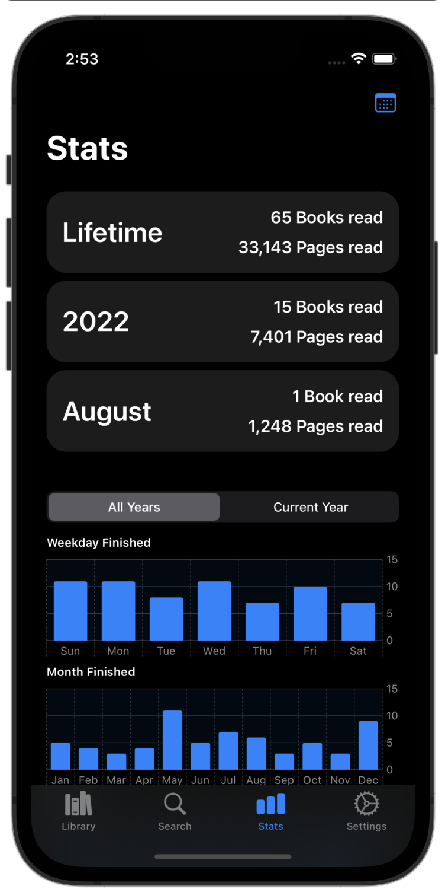

<h1 align="center">
    
     
    Flip
 </h1>

Flip is a project aimed at helping users manage their library of books. It has a clean user interface, allows users to sort and filter their library with various conditions, and offers interesting insight into user reading history. Flip syncs user data across their devices and integrates with [Spotlight](https://developer.apple.com/documentation/corespotlight) and provides widgets for keeping up with your reading goal at a glance. Flip's minimum requirements are iOS 16 and iPadOS 16.

Flip is built using the [Swift](https://www.swift.org) language, [SwiftUI](https://developer.apple.com/xcode/swiftui/) for the UI, [Core Data](https://developer.apple.com/documentation/coredata) + [Cloud Kit](https://developer.apple.com/documentation/cloudkit) for managing user data, the [Google Books API](https://developers.google.com/books) for fetching data related to user queries, and the [Open Library Covers API](https://openlibrary.org/dev/docs/api/covers) for fetching covers when necessary.

## Features

- **Clean User Interface**: Flip offers a clean user interface with a simple, intuitive interface.
- **iCloud Data Sync**: Flip seamlessly syncs user data across iCloud enabled devices.
- **Security**: Users can optionally require biometrics such as [Face ID](https://support.apple.com/en-us/HT208108) or [Touch ID](https://support.apple.com/en-us/HT201371) in order to access Flip.
- **Spotlight Integration**: Flip integrates with Apple's [Spotlight](https://developer.apple.com/documentation/corespotlight) to allow users easier access to their library.
- **Reading Goal**: Flip allows users to set a reading goal and keeps them up to date on their progress.
- **Stats**: Flip provides stats on user reading history and provides insight into user reading/rating habits.
- **Widgets**: Flip provides widgets for keeping up with your reading goal at a glance.
- **Customization**: Flip allows users to customize the appearance of the app by selecting their preferred color scheme and app icon.
- **Search**: Flip allows users to search through Google Book's library of books in order to easier add books to their library.
- **Import/Export**: Flip allows users to import and export so that they can easily move services while maintaining their library.
- **Custom Entries**: Flip allows users to create custom entries for their library or modify existing entries if they want to add additional details or change the book cover image.

## Screenshots

### Library

    
    
    
    
    
    

### Search

    

### Stats

    
    
    
    

### Settings

    
    
    
    
    
    

### Example Color Scheme

    
    
    
    

### Widgets

    
    
    
    

### Other

    
    

